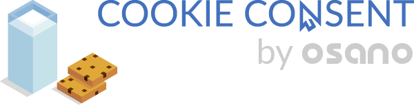

# @activescott/cookieconsent

[](https://www.npmjs.com/package/@activescott/cookieconsent)
[](https://github.com/activescott/cookieconsent/actions)
[![MIT License][li]][ll]

This is a just-enough-working fork of https://github.com/osano/cookieconsent. This fork has the following differences:

1. It works. I had to update some dependencies to get it to even build. It appears that [Osano has decided to abandon](https://github.com/osano/cookieconsent/pull/784#issuecomment-734986300) the open source version of their package with a response of _"we recommend just using the free version of our commercial offering"_.
2. Uses the v4.0 code base which was never published to npm, but was pushed to github.
3. Is module-only and doesn't attach a global to the window by default.
4. Includes some minimal typescript types in the package.
5. Exporting the original source rather than the minified bundle. I presume you'll use your own bundler.
6. It is automatically deployed according to the release process described below (so send me your PR and as long as it passes CI and is reasonable improvement I will merge it).

## Usage

To use it, install using

```sh
npm install -P "@activescott/cookieconsent"
```

## Release Process (Deploying to NPM) 🚀

We use [semantic-release](https://github.com/semantic-release/semantic-release) to consistently release [semver](https://semver.org/)-compatible versions. This project deploys to multiple [npm distribution tags](https://docs.npmjs.com/cli/dist-tag). Each of the below branches correspond to the following npm distribution tags:

| branch | npm distribution tag |
| ------ | -------------------- |
| master | latest               |
| beta   | beta                 |

To trigger a release use a Conventional Commit following [Angular Commit Message Conventions](https://github.com/angular/angular.js/blob/master/DEVELOPERS.md#-git-commit-guidelines) on one of the above branches.

## What's next?

I don't have concrete plans, but if we had a quorum of 2-3 other folks interested in keeping this fork up to date, I'd be willing to invest some time to automate publishing and start accepting PRs and issues (although now that I've looked through this code base 😬, we should really just rewrite it).

I just want to keep my use of this package working for now. I am considering the following:

- [x] Setting up automated publishing to NPM with semantic-release
- [ ] Export `module` in package.json as ES6 (right?) separate from the `main`. Ensure main is transpiled to CJS.

## The remainder of this readme (below) is from the original repo that this was forked from at https://github.com/osano/cookieconsent

---

[![Build Status][bi]][bl]
[![MIT License][li]][ll]
[![Twitter][ti]][tl]

<p align="center"><a href="https://www.osano.com/features/consent-management?utm_campaign=Open%20Source%20Cookie%20Consent&utm_source=github"></a></p>

## What is Cookie Consent?

[Cookie Consent][cl] is a lightweight JavaScript plugin for alerting users about the use of cookies on your website.

It is designed to help you quickly comply with the EU Cookie Law, CCPA, GDPR and other privacy laws. We made it fast, free, and relatively painless.

Cookie Consent is seen over 2 BILLION times every month and is used on millions of sites, making this by far the most popular consent project on the internet.

We welcome community contributions and actively review pull requests.

## Hosted Zero Config Consent

Our parent company Osano actively maintains this open source project. Osano is a B-corp and is backed by millions of dollars in venture capital to create data privacy tools for the world. Our mission is to create transparency in data, please consider [joining our team](https://www.osano.com/company/careers).

Ensuring that your website is compliant with various laws can be complicated. To effectively use **any** open source consent manager, you will need to do GeoIP lookups, adjust the consent types based on visitor location, callback and save consents in a database, and create callbacks to load scripts after consent is granted.

Osano offers a completely [free hosted consent management platform][cl], with additional features. If you have a high traffic website or need additional privacy tools, Osano offers paid plans as well. **Unless you specifically need the open source tool, most website owners will be better served by the hosted version.** If you use Osano for your business, please support continued development by purchasing a [paid plan](https://www.osano.com/plans?utm_campaign=Open%20Source%20Cookie%20Consent&utm_source=github).

The hosted version of the cookie consent manager provides additional capabilities such as:

- Multi-lingual, translated into 38 languages and growing. Visitors automatically see the dialog in their browser or OS preferred language.
- Consents are stored automatically on the blockchain. REST API calls are available to developers to search and browse the consent records.
- 3rd party script blocking and loading does not require callbacks but is instead configurable from a dashboard providing developers with control over what the marketing team can enable or disable.
- Hosted on AWS Cloudfront with edges around the globe for

## Basic Use

With version 4.0 you only need to attach the script as we've bundled everything together now. The initialization style has changed as have the callbacks (they're gone). Please see the text below to get started. Then, take a look at updated API via the [docs][dl].

#### Module

```
import CC from "CookieConsent"
// or
const CC = require( "CookieConsent" )
```

#### Classic

```
const CC = window.CookieConsent
```

##### Initialization:

```
const cc = new CC({
  //...options,
  type   : "categories"
})
```

##### Lifecycle hooks, are now events:

```
cc.on( "initialized", ( ...args ) => console.log( args ) )
cc.on( "error", console.error )
cc.on( "popupOpened", () => console.log( "Popup Open" ) )
cc.on( "popupClosed", () => console.log( "Popup Closed" ) )
cc.on( "revokeChoice", () => console.log( "Popup Reset" ) )
cc.on( "statusChanged", ( ...args ) => console.log( args ) )
```

## Version 4.0

Lots of updates & some breaking changes... but they're all for the better, we promise!

## Version 3.1

Reflects the ownership change of the Cookie Consent project. Now actively maintained by:

- @arlogilbert
- @L0key
- @pgoforth

## Version 3.0

Version 3.0 is a complete rewrite from version 2. The most substantial new features are:

- Ability to GeoLocate and only show the add-on to people in the relevant countries
- Callback hooks for showing/accepting/revoking the banner
- Support for different types of compliance, giving you the flexibility to obey even the strictest cookie laws
- Easy no-fuss themes and customisable styles

## Installation

The easiest way to get up and running is to use our [wizard][dll].

You can also install this project through [npm](https://www.npmjs.com/package/cookieconsent):

```sh
npm install cookieconsent
```

Or through [Yarn](https://yarnpkg.com/en/package/cookieconsent):

```sh
yarn add cookieconsent@3
```

Or through [Bower](https://bower.io/):

```sh
bower install cookieconsent
```

Or via a jsDelivr:

```html
<script src="https://cdn.jsdelivr.net/npm/cookieconsent@3/build/cookieconsent.min.js"></script>
```

## Documentation

See our [full documentation][dl].

## Contributing

Feel free to improve the plugin and send us a pull request.

The easiest way to develop is to host the files with a local webserver. e.g.

```sh
python -m SimpleHTTPServer
```

We use Babel, Terser, and PostCSS to compile the SCSS and minify the JavaScript. You can run a build with:

```sh
npm run build
```

or

```sh
yarn run build
```

## Legal Mumbo Jumbo

Osano is a registered trademark of Osano, Inc.

Nothing on the Osano website, platform, services, or software, nor any portion thereof constitutes actual legal or regulatory advice, opinion, or recommendation by Osano, Inc. or Osano International Compliance Services LTD.

**If legal assistance is required, users should seek the services of an attorney.**

## Export Control

This distribution includes cryptographic software. The country in which you
currently reside may have restrictions on the import, possession, use, and/or
re-export to another country, of encryption software. BEFORE using any
encryption software, please check your country's laws, regulations and
policies concerning the import, possession, or use, and re-export of encryption
software, to see if this is permitted. See <http://www.wassenaar.org/> for more
information.

The U.S. Government Department of Commerce, Bureau of Industry and Security
(BIS), has classified this software as Export Commodity Control Number (ECCN)
5D002.C.1, which includes information security software using or performing
cryptographic functions with asymmetric algorithms. The form and manner of this
Apache Software Foundation distribution makes it eligible for export under the
License Exception ENC Technology Software Unrestricted (TSU) exception (see the
BIS Export Administration Regulations, Section 740.13) for both object code and
source code.

[li]: https://img.shields.io/badge/license-MIT-brightgreen.svg
[ll]: LICENSE
[bl]: https://travis-ci.org/osano/cookieconsent
[bi]: https://travis-ci.org/osano/cookieconsent.svg?branch=master
[dl]: https://www.osano.com/cookieconsent/documentation/
[dll]: https://www.osano.com/features/consent-management?utm_campaign=Open%20Source%20Cookie%20Consent&utm_source=github
[cl]: https://www.osano.com/features/consent-management?utm_campaign=Open%20Source%20Cookie%20Consent&utm_source=github
[ti]: https://img.shields.io/twitter/url/https/osanoatx.svg?style=social
[tl]: https://twitter.com/osano
